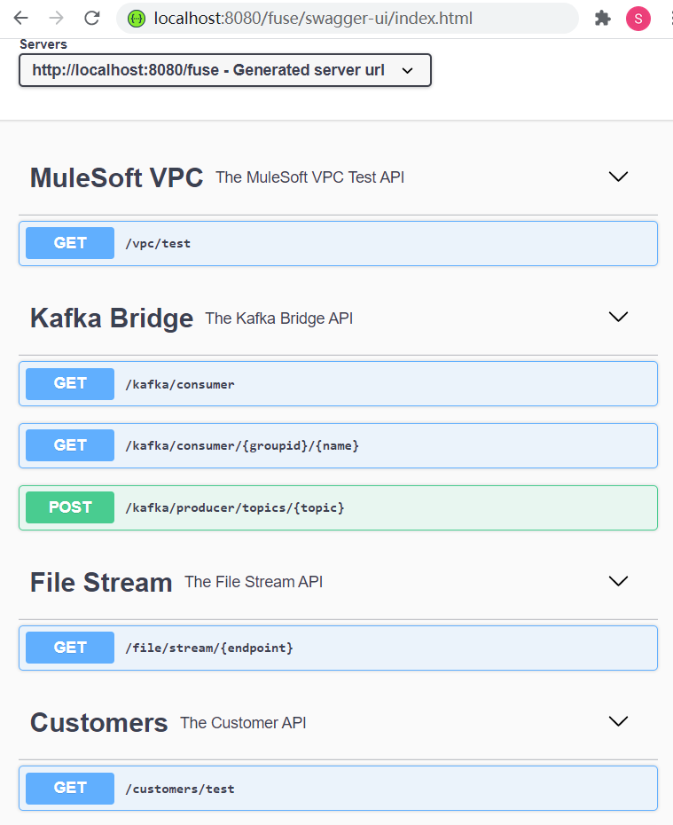

# Spring-Boot Camel QuickStart

This example demonstrates how you can use Apache Camel with Spring Boot.

The quickstart uses Spring Boot to configure a little application that includes a Camel route that triggers a message every 5th second, and routes the message to a log.
### 0. Precondition
Install lombok plugin for your IDE:

- Eclipse/CodeReady Studio: https://projectlombok.org/setup/eclipse
- IntelliJ IDEA: https://projectlombok.org/setup/intellij
- Visual Studio Code: https://projectlombok.org/setup/vscode

### 1. Building

The example can be built with

    mvn clean install

### 2. Running the example in local

    mvn spring-boot:run

### 3. Check API Spec in Swagger page

    http://localhost:8080/fuse/swagger-ui/index.html

    
### 4. Run test cases by Postman
Import the test collection file in Postman, check Mule API related test cases.    

### 5. (Optional) Running the example in OpenShift
Login OpenShift

    oc login https://openshift-hostname:8443 --token=xxxx

It is assumed that:
- OpenShift platform is already running, if not you can find details how to [Install OpenShift at your site](https://docs.openshift.com/container-platform/3.3/install_config/index.html).
- Your system is configured for Fabric8 Maven Workflow, if not you can find a [Get Started Guide](https://access.redhat.com/documentation/en/red-hat-jboss-middleware-for-openshift/3/single/red-hat-jboss-fuse-integration-services-20-for-openshift/)

The example can be built and run on OpenShift using a single goal:

    mvn fabric8:deploy

When the example runs in OpenShift, you can use the OpenShift client tool to inspect the status

To list all the running pods:

    oc get pods

Then find the name of the pod that runs this quickstart, and output the logs from the running pods with:

    oc logs <name of pod>

You can also use the OpenShift [web console](https://docs.openshift.com/container-platform/3.3/getting_started/developers_console.html#developers-console-video) to manage the
running pods, and view logs and much more.

### Running via an S2I Application Template

Application templates allow you deploy applications to OpenShift by filling out a form in the OpenShift console that allows you to adjust deployment parameters.  This template uses an S2I source build so that it handle building and deploying the application for you.

First, import the Fuse image streams:

    oc create -f https://raw.githubusercontent.com/jboss-fuse/application-templates/GA/fis-image-streams.json

Then create the quickstart template:

    oc create -f https://raw.githubusercontent.com/jboss-fuse/application-templates/GA/quickstarts/spring-boot-camel-template.json

Now when you use "Add to Project" button in the OpenShift console, you should see a template for this quickstart. 

